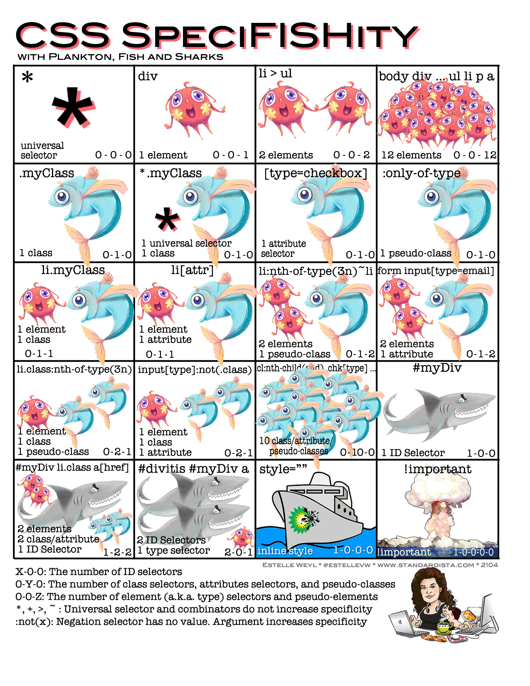

# CSS

## 一、 css 伪类和伪元素的区别

伪类用于向某些选择器添加特殊的效果，伪元素用于将特殊的效果添加到某些选择器。两者都与选择器相关，第二就是添加一些“特殊”的效果

1. 伪类和伪元素都是用来表示文档树以外的的“元素”
2. css3 规定伪类和伪元素分别用单冒号和双冒号来表示
3. 伪类的效果可以通过添加一个实际的类来达到，而伪元素的效果则需要通过添加一个实际的元素才能达到

## 二、 link 和 @import 区别

1. link 是 XHTML 标签，除了加载 CSS 外，还可以定义 RSS 等其他事务；@import 属于 CSS 范畴，只能加载 CSS。
2. link 引用 CSS 时，在页面载入时同时加载；@import 需要页面网页完全载入以后加载。
3. link 是 XHTML 标签，无兼容问题；@import 是在 CSS2.1 提出的，低版本的浏览器不支持。
4. ink 支持使用 Javascript 控制 DOM 去改变样式；而@import 不支持。

## 三、 BFC

### 3.1 常见定位方案

- 普通流 (normal flow)
  > 在普通流中，元素按照其在 HTML 中的先后位置至上而下布局，普通流中元素的位置由该元素在 HTML 文档中的位置决定。
- 浮动 (float)
  > 在浮动布局中，元素首先按照普通流的位置出现，然后根据浮动的方向尽可能的向左边或右边偏移，其效果与印刷排版中的文本环绕相似。
- 绝对定位 (absolute positioning)
  > 在绝对定位布局中，元素会整体脱离普通流，因此绝对定位元素不会对其兄弟元素造成影响，而元素具体的位置由绝对定位的坐标决定。

### 3.2 什么是 BFC

BFC 即 Block Formatting Contexts (块级格式化上下文)，它属于上述定位方案的普通流。

具有 BFC 特性的元素可以看作是隔离了的独立容器，容器里面的元素不会在布局上影响到外面的元素，并且 BFC 具有普通容器所没有的一些特性。

通俗一点来讲，可以把 BFC 理解为一个封闭的大箱子，箱子内部的元素无论如何翻江倒海，都不会影响到外部。

### 3.3 触发 BFC

以下元素会触发 BFC

- body 根元素
- 浮动元素：float 除 none 以外的值
- 绝对定位元素：position (absolute、fixed)
- display 为 inline-block、table-cells、flex
- overflow 除了 visible 以外的值 (hidden、auto、scroll)

### 3.4 BFC 的作用

1. 不和浮动元素重叠
2. 清除元素内部浮动
3. 防止垂直 margin 重叠

## 四、 css 居中的方式
### 4.1 flex
### 4.2 position transform
### 4,3 position absolute
## 五、 重排重绘

### 浏览器分层

通常页面的组成是非常复杂的，如果没有采用分层机制，从布局树直接生成目标图片的话，那么每次页面发生很小的变化，就会全部发生重排重绘，严重影响页面渲染效率

transform 属于合成属性是独立的层，left、top等会导致重排

## 六、 通过 link 引入的 css 会阻碍页面渲染吗，如何解决

## 七、样式的计算顺序

## 八、css预处理器
### 解决的问题
1. css语法不够强大，无法嵌套，导致很多重复的选择器
2. 没有变量和合理的复用机制

### 好处
1. 代码简洁易维护，节省了大量代码
2. 容易找到要修改的
3. 嵌套减少了大量重复的选择器
4. 变量、混入提升了复用性