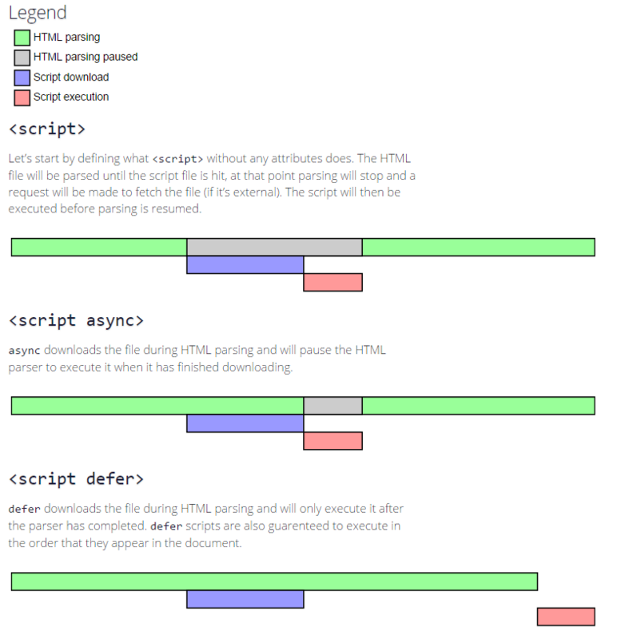

# HTML

## 一、 元素分类

#### 1）内联元素

```
span,a,b,strong,i,em,br,input,textarea
```

- 本身属性为 display:inline
- 从左到右一行显示
- 不能控制宽、高，但是可以设置内外边框左右值

#### 2）块级元素

```
div,h1-h6,hr,menu,ol,ul,li,table,p,form
```

- 本身属性为 display:block
- 独占一行，从上到下布局
- 可以控制宽、高等相关属性
- 不设置宽高的情况下，是它父级的宽高

#### 3）内联块级元素

- 能够识别 width、height、line-height、padding、margin
- 默认从左到右排列

#### 元素的应用场景

- 内联元素：用于不指定宽高，宽高由内容指定
- 块级元素：用于指定宽高，标签占满一行
- 内联块级元素：用于指定元素宽高，不占满一行

## 二、 语义化

根据不同的内容只用合适的标签，即为语义化

### 2.1 语义化优点：

1. 利于 SEO ，对搜索引擎友好，容易被搜索引擎抓取
2. 便于其他开发者阅读
3. 结构明确，在样式没有加载前也有较为明确的结构
4. 方便其他设备阅读

### 2.2 如何语义化

1. 少用无语义化的 div 和 span
2. 语义不明显时，div||p，使用 p，因为 p 有上下间距，对兼容特殊终端有利
3. 不要使用纯样式标签，如 b、font、u
4. input 对应的说明使用 label

## 三、 meta

### 3.1 元数据

1. 用来构建 HTML 文档的基本结构
2. 处理文档向浏览器提供信息和指示
3. 如 title、base、meta

### 3.2 meta 元素

可提供有关页面的元信息，比如针对**搜索引擎**和**更新频度**的描述和关键词

包括四大属性：

1. charset:声明字符编码
2. content：配合`name`或`http-equiv`使用，为这两种提供 值
3. http-equiv：可以用作 HTTP 头部的某些作用
4. name：定义页面的元数据，只能跟 content 以前使用

## 四、 大量 dom 怎么优化？

1. 缓存 DOM 对象，提前获取 dom
   ```js
   let rootElem = document.querySelector("#app");
   let childList = rootElem.child; // 假设全是dom节点
   for (let i = 0; i < childList.len; j++) {
     /**
      * 根据条件对应操作
      */
   }
   ```
2. 文档碎片
3. 使用 innerHTML 代替 appendChild
4. 批量读，一次性写；使用 requestAnimationFrame
5. 虚拟 DOM

## 五、 async 和 defer 区别

浏览器在执行 HTML 的时候遇到 `<script>` 会停止渲染，然后去下载和执行 js 文件 直到遇到 `</script>` 才会继续渲染页面；所以，浏览器在执行 js 的时候会是一片空白，为了解决这个问题 ECS 定义了 `defer` 和 `async`来解决这个问题

使用这两个属性不能使用`document.write`方法
这两个属性同时出现的情况下 async 会覆盖 defer

### 5.1 async

js 边加载 js - 边解析 - 边执行

Load 事件触发前执行，容易出现脚本执行顺序打乱；

### 5.2 defer

js 边加载 js - 边解析， **执行** 等到所有元素解析完

整个文档解析完成后，触发 DOMContentLoaded 事件前执行，解析完后按照解析的顺序执行；


## 六、DomContentLoaded 和 load

### 6.1 DomContentLoaded 事件的触发

当初始的 HTML 文档被完全加载和解析完成之后，DOMContentLoaded 事件被触发，而无需等待样式表、图像和子框架的完成加载

### 6.2 load 事件的触发

load 仅用于检测一个完全加载的页面

当页面 DOM 结构中的 js、css、图片，以及 js 异步加载的 js、css 、图片都加载完成之后，才会触发 load 事件

## 七、 prefetch preload

都是告知浏览器提前加载文件(图片、视频、js、css 等)，但执行上是有区别的

有些情况我们需要某些依赖在浏览器进入渲染的主进程之前就希望被加载

1. preload 和 prefetch 都没有同域名的限制；
2. preload 主要用于预加载当前页面需要的资源；而 prefetch 主要用于加载将来页面可能需要的资源；

### 7.1 prefetch

被标记为 prefetch 的资源，将会被浏览器在空闲时间加载

### 7.2 preload

preload 通常用于本页面要用到的关键资源，包括关键 js、字体、css 文件。preload 将会把资源得下载顺序权重提高，使得关键数据提前下载好，优化页面打开速度。

<!-- esbuild没有prepack

- 4 处理图片文本使用 url-loader file-loader
- 5 本身用assete modules,不需要配置loader


redux -> flow 复杂了
mobx -> 闭包 @observe
mobx-lite 10kb
useReducer ->redux
recoil -->
