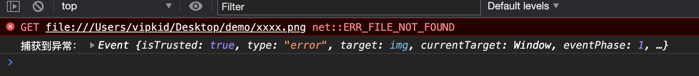

# 错误监控

1. 可疑区域增加 `try...catch`
2. 全局监控 JS 异常： `window.onerror`
3. 全局监控静态资源异常： `window.addEventListener`
4. 全局捕获没有 catch 的 `promise` 异常：unhandledrejection
5. iframe 异常：`window.error`
6. VUE `errorHandler` 和 React `componentDidCatch`
7. 监控网页崩溃：window 对象的 `load` 和 `beforeunload`
8. Script Error 跨域 crossOrigin 解决

异常的出现不会直接导致 JS 引擎崩溃，最多只是终止当前代码的执行。下面来解释一下这句话：

```js
<script>
    error // 没定义过的变量，此处会报错
    console.log('永远不会执行');
</script>
<script>
    console.log('我继续执行')
</script>
```

## 一、 try...catch

`try...catch`只能捕获到同步的运行时错误，对于语法和异步错误无能为力，捕获不到。

### 1.1 同步运行时错误

```js
try {
  let name = "Jack";
  console.log(nam);
} catch (e) {
  console.log("捕获到异常：", e);
}

// 输出：
// 捕获到异常： ReferenceError: nam is not defined
```
`e`有延长作用域链的问题，能够欺骗词法作用域

### 1.2 不能捕获语法错误

```js
try {
    // 我们修改一个代码，删掉一个单引号👇
    let name = 'Jack;
    console.log(nam);
} catch(e) {
    console.log('捕获到异常：',e);
}

// 输出：
// Uncaught SyntaxError: Invalid or unexpected token
```

::: tip 提示
`语法错误SyntaxError，不管是window.error还是try...catch都没法捕获异常。`
但是不用担心，在你写好代码按下保存那一刻，编译器会帮你检查是否有语法错误，如果有错误有会有个很明显的红红的波浪线，把鼠标移上去就能看到报错信息
:::

### 1.3 异步错误

```js
try {
  setTimeout(() => {
    undefined.map((v) => v);
  }, 1000);
} catch (e) {
  console.log("捕获到异常：", e);
}

// 输出：
// Uncaught TypeError: Cannot read property 'map' of undefined
```

## 二、 window.onerror()

当 JS 运行时错误发生时，window 会触发一个 ErrorEvent 接口的 error 事件，并执行 window.onerror() 。

```js
/**
 * @param {String} message 错误信息
 * @param {String} source 出错文件
 * @param {Number} lineno 行号
 * @param {Number} colno 列号
 * @param {Object} error Error对象（对象）
 */

window.onerror = function(message, source, lineno, colno, error) {
  console.log("捕获到异常：", { message, source, lineno, colno, error });
};
```

### 2.1 同步运行时错误

可以捕获到

### 2.2 语法错误

```js
window.onerror = function(message, source, lineno, colno, error) {
    console.log('捕获到异常：',{message, source, lineno, colno, error});
}
 // 少个单引号👇
let name = 'Jack;

// 控制台打印出了这样的异常：捕获不到异常
// Uncaught SyntaxError: Invalid or unexpected token
```

### 2.3 异步运行时错误

```js
window.onerror = function(message, source, lineno, colno, error) {
  console.log("捕获到异常：", { message, source, lineno, colno, error });
};
setTimeout(() => {
  UndefVar;
});
// 捕获到异常
//  Uncaught ReferenceError: UndefVar is not defined
```

### 2.4 网络请求的异常

```js
<script>
window.onerror = function(message, source, lineno, colno, error) {
    console.log('捕获到异常：',{message, source, lineno, colno, error});
    return true;
}
</script>

// 并没有捕获到异常
```

::: tip 提示
不论是静态资源异常，或者接口异常，错误都无法捕获到

- `window.onerror` 函数只有在返回 true 的时候，异常才不会向上抛出（浏览器接收后报红），否则即使是知道异常的发生控制台还是会显示 Uncaught Error: xxxxx
- `window.onerror` 最好写在所有 JS 脚本的前面，否则有可能捕获不到错误
- `window.onerror` 无法捕获语法错误
  :::

#### 如何捕获静态资源加载错误呢？**`window.addEventListener`**

## 三、 window.addEventListener

当一项资源（如图片和脚本加载失败），加载资源的元素会触发一个 Event 接口的 error 事件，并执行该元素上的 onerror 处理函数。

这些 error 事件不会向上冒泡到 window， 不过（至少在 Chrome 中）能被单一的 window.addEventListener 捕获

```js
<script>
window.addEventListener('error', (error) => {
console.log('捕获到异常：', error);
}, true)
</script>


// 可以捕获异常：
```



由于网络请求异常不会事件冒泡，因此必须在捕获阶段将其捕捉到才行，但是这种方式虽然可以捕捉到网络请求的异常，但是**无法判断 HTTP 的状态是 404 还是其他比如 500 等等**，所以还需要配合服务端日志才进行排查分析才可以。

不同浏览器下返回的 `error` 对象可能不同，需要注意兼容处理。 需要注意避免 `window.addEventListener` 重复监听。

::: tip 结论

- 在开发的过程中，对于容易出错的地方，可以使用`try{}catch(){}`来进行错误的捕获，做好兜底处理，避免页面挂掉。
- 而对于全局的错误捕获，在现代浏览器中，我倾向于只使用使用`window.addEventListener('error')`，`window.addEventListener('unhandledrejection')`就行了。
- 如果需要考虑兼容性，需要加上`window.onerror`，三者同时使用，`window.addEventListener('error')` 专门用来捕获资源加载错误。
  :::

## 四、 Promise Catch

我们知道，在 `promise` 中使用 `catch` 可以非常方便的捕获到异步 `error` 。
没有写`catch`的`promise`中抛出的错误无法被`onerror`或`try...catch`捕获到，所以务必在`promise`中写`catch`做异常处理。

### unhandledrejection

有没有一个全局捕获`promise`的异常呢？答案是有的。 `Uncaught Promise Error`就能做到全局监听，使用方式：

```js
window.addEventListener("unhandledrejection", function(e) {
  // e.preventDefault(); // 阻止异常向上抛出
  console.log("捕获到异常：", e);
});
Promise.reject("promise error");
```

为了防止有漏掉的 promise 异常，建议在全局增加一个对 `unhandledrejection` 的监听，用来全局监听 Uncaught Promise Error。

<!-- ## 五、 iframe 异常
对于 iframe 的异常捕获，我们还得借力 window.onerror：
```js
<iframe src="./iframe.html" frameborder="0"></iframe>
<script>
window.frames[0].onerror = function (message, source, lineno, colno, error) {
    console.log('捕获到 iframe 异常：', {message, source, lineno, colno, error});
};
</script>
``` -->

## 五、 fetch 与 xhr 错误的捕获

对于 fetch 和 xhr，我们需要通过改写它们的原生方法，在触发错误时进行自动化的捕获和上报。

### fetch 的方法

```js
// fetch的处理
function _errorFetchInit() {
  if (!window.fetch) return;
  let _oldFetch = window.fetch;
  window.fetch = function() {
    return (
      _oldFetch
        .apply(this, arguments)
        .then((res) => {
          if (!res.ok) {
            // 当status不为2XX的时候，上报错误
          }
          return res;
        })
        // 当fetch方法错误时上报
        .catch((error) => {
          // error.message,
          // error.stack
          // 抛出错误并且上报
          throw error;
        })
    );
  };
}
```

### XMLHttpRequest 的重写

```js
function _errorAjaxInit () {
    let protocol = window.location.protocol;
    if (protocol === 'file:') return;
    // 处理XMLHttpRequest
    if (!window.XMLHttpRequest) {
        return;
    }
    let xmlhttp = window.XMLHttpRequest;
    // 保存原生send方法
    let _oldSend = xmlhttp.prototype.send;
    let _handleEvent = function (event) {
        try {
            if (event && event.currentTarget && event.currentTarget.status !== 200) {
                    // event.currentTarget 即为构建的xhr实例
                    // event.currentTarget.response
                    // event.currentTarget.responseURL || event.currentTarget.ajaxUrl
                    // event.currentTarget.status
                    // event.currentTarget.statusText
                });
            }
        } catch (e) {va
            console.log('Tool\'s error: ' + e);
        }
    }
    xmlhttp.prototype.send = function () {
        this.addEventListener('error', _handleEvent); // 失败
        this.addEventListener('load', _handleEvent);  // 完成
        this.addEventListener('abort', _handleEvent); // 取消
        return _oldSend.apply(this, arguments);
    }
}
```

## 六、VUE 和 React 的异常

### vue errorHandler

在 Vue 中，异常可能被 Vue 自身给 try...catch 了，不会传到 window.onerror 事件触发。不过不用担心，Vue 提供了特有的异常捕获，比如 Vux2.x 中我们可以这样用：

```js
Vue.config.errorHandler = function(err, vm, info) {
  let {
    message, // 异常信息
    name, // 异常名称
    script, // 异常脚本url
    line, // 异常行号
    column, // 异常列号
    stack, // 异常堆栈信息
  } = err;

  // vm为抛出异常的 Vue 实例
  // info为 Vue 特定的错误信息，比如错误所在的生命周期钩子
};
```

### React componentDIdCatch

在 React，可以使用 ErrorBoundary 组件包括业务组件的方式进行异常捕获，配合 React 16.0+新出的`componentDidCatch` API，可以实现统一的异常捕获和日志上报。
