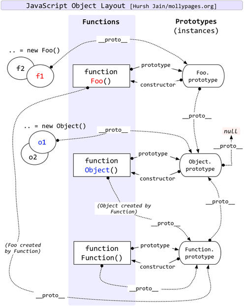

# 原型和原型链

想了解原型需要从 JS 这门语言的设计初衷开始来理解

## 原型

### 一、从 js 设计目的开始

1994 年网景公司开发出了第一个网络浏览器，但是整个页面没有任何可以好访问者交互的能力

🆚 例如：表单提交，没有任何验证，什么都不输入然后提交表单后，就只能靠服务端返回信息提示，太消耗网络资源

然后就急需一门网页脚本语言，使得浏览器可以与网页互动

工程师 Brendan Eich 负责开发这种新语言。他觉得，没必要设计得很复杂，这种语言只要能够完成一些简单操作就够了，比如判断用户有没有填写表单

🚗 总结：设计 js 的目的就是让浏览器可以与网页互动

### 二、遇到的问题

- 要不要继承机制
- 如果不需要，那么如何将所有对象联系起来
- 如何共享属性和方法

#### 2.1 继承机制

1994 年正是面向对象编程最兴盛的时期，Brendan Eich 无疑受到了影响，**Javascript 里面所有的数据类型都是对象（object）**，这一点与 Java 非常相似。但是，他随即就遇到了一个难题

❓ 到底要不要设计**继承机制**呢 (O_o)??

- 如果真的是一种简易的脚本语言，其实不需要有"继承"机制
- 但是，Javascript 里面都是对象，必须有一种机制，将所有对象联系起来

但是，他不打算引入"类"（class）的概念，因为一旦有了"类"，Javascript 就是一种完整的面向对象编程语言了，违背了一开始的设计初衷

🚗 总结：不需要继承，但是需要一种机制将所有对象联系起来

#### 2.2 构造函数

他考虑到，C++和 Java 语言都使用 new 命令，生成实例。

C++的写法是：

```c++
　　ClassName *object = new ClassName(param);
```

Java 的写法是：

```java
　　Foo foo = new Foo();
```

因此，他就把 `new` 命令引入了 Javascript，用来从原型对象生成一个实例对象。

但是，Javascript 没有"类"，怎么来表示原型对象呢？

这时，他想到 C++和 Java 使用 new 命令时，都会调用"类"的构造函数（constructor）。他就做了一个简化的设计，在 Javascript 语言中，**new 命令后面跟的不是类，而是构造函数**。

```js
// 构造函数
function DOG(name) {
  this.name = name; //🚆 示例对象 this
}

// 对这个构造函数使用 new，就会生成一个狗对象的 实例。
const dogA = new DOG("大毛");
```

🚗 总结：使用构造函数来将所有的对象联系起来，**构造函数和普通函数的区别就是，构造函数前面有`new`**

#### 2.3 prototype

每一个实例对象，都有自己的属性和方法的副本。这不仅无法做到数据共享，也是极大的资源浪费。

考虑到这一点，Brendan Eich 决定为构造函数设置一个`prototype`属性。

这个属性包含一个对象，所有实例对象需要共享的属性和方法，都放在这个对象里面；那些不需要共享的属性和方法，就放在构造函数里面。

实例对象一旦创建，将自动引用 prototype 对象的属性和方法。

🚗 总结：为构造函数设置一个`prototype`属性，将需要共享的属性和方法放到里面

#### constructor

❓ 如何实现 继承呢？
任何一个 prototype 对象都有一个 constructor 属性，指向它的构造函数

每一个实例也有一个 constructor 属性，默认调用 prototype 对象的 constructor 属性

```js
function Animal() {
  this.species = "动物";
}
function Cat(name, color) {
  this.name = name;
  this.color = color;
}
// ❓ 怎样才能使"Cat"继承"Animal"呢？

/*

*/

Cat.prototype = new Animal();
Cat.prototype.constructor = Cat;
```

### 三、总结

由于所有的实例对象共享同一个 prototype 对象，那么从外界看起来，prototype 对象就好像是实例对象的原型，而实例对象则好像"继承"了 prototype 对象一样。

## 原型链

JavaScript 中的每一个对象都有一个 prototype 属性，成为原型，而原型的值也是一个对象，因此它也有自己的原型，这样就串联成一条原型链，原型链的链头是 object

如果找到 Object.prototype 上还找不到，原路返回，告诉实例此方法或属性没有找到或者没有定义。如果说在中间的任意一个环节找到了，他就停止向上查找直接返回这个方法的用处



### prototype 和 **proto**

prototype（显式原型）是构造函数才有，指向当前的原型对象，用来实现 基于原型的继承和属性的共享

**proto**（隐式原型） Object.create(null)创建的对象没有 **proto**

## 四、new

new 运算符创建一个用户定义的对象类型的实例或具有构造函数的内置对象的实例。new 关键字会进行如下的操作：

1. 创建一个空的简单 JavaScript 对象（即{}）；
2. 链接该对象（即设置该对象的构造函数）到另一个对象 ；
3. 将步骤 1 新创建的对象作为 this 的上下文 ；
4. 如果该函数没有返回对象，则返回 this。

```js
// 参考答案：1.简单实现
function newOperator(ctor) {
  if (typeof ctor !== "function") {
    throw "newOperator function the first param must be a function";
  }
  var args = Array.prototype.slice.call(arguments, 1);
  // 1.创建一个空的简单JavaScript对象（即{}）
  var obj = {};
  // 2.链接该新创建的对象（即设置该对象的__proto__）到该函数的原型对象prototype上
  obj.__proto__ = ctor.prototype;
  // 3.将步骤1新创建的对象作为this的上下文
  var result = ctor.apply(obj, args);
  // 4.如果该函数没有返回对象，则返回新创建的对象

  var isObject = typeof result === "object" && result !== null;
  var isFunction = typeof result === "function";
  return isObject || isFunction ? result : obj;
}

// 测试
function company(name, address) {
  this.name = name;
  this.address = address;
}

var company1 = newOperator(company, "yideng", "beijing");
console.log("company1: ", company1);
```

## 五、继承

### 5.1 原型链

```js
function Parent() {
  this.name = "kevin";
}
Parent.prototype.getName = function() {};

function Child() {}
Child.prototype = new Parent();

var child1 = new Child();
console.log(child1.getName()); // kevin
```

缺点：

- 在包含有引用类型的数据时，会被所有的实例对象所共享，容易造成修改的混乱
- 还有就是在 创建子类型 的时候不能向 父类型 传递参数。（因为是共用的一套数据）

### 5.2 借用构造函数

通过在 子类型的函数中 调用 父类型的构造函数 来实现的
```js
function Parent () {
  this.names = ['kevin', 'daisy'];
}
// 修改了this指向
function Child () {
  Parent.call(this);
}

var child1 = new Child();
child1.names.push('yayu');
console.log(child1.names); // ["kevin", "daisy", "yayu"]

var child2 = new Child();
console.log(child2.names); // ["kevin", "daisy"]
```
- 特点：
  - 避免了引用类型的属性被所有实例共享
  - 解决了不能向超类型传递参数的缺点
- 缺点：
  - 无法复用，方法都在构造函数中定义，每次创建实例都会创建一遍方法
  - 父类型原型 定义的方法，子类型访问不到

### 5.3 组合继承（原型链+构造函数）

利用原型链继承和构造函数继承的各自优势进行组合使用

```js
// ①利用原型链继承，实现原型对象方法的继承
// ②利用构造函数继承，实现属性的继承
function Parent(name){
  this.name = name;
  this.type = ['JS','HTML','CSS'];
}
Parent.prototype.Say=function(){
  console.log(this.name);
}
function Son(name){
  Parent.call(this,name);
}
Son.prototype = new Parent();
son1 = new Son('张三');
son2 = new Son('李四');

```
缺点：都会调用两次父级构造函数：一次是在创建子级原型的时候，另一次是在子级构造函数内部
### 5.4 原型式继承
向函数中传入一个对象，然后返回一个以这个对象为原型的对象。
```js
function fun(obj) {
  function Son(){};
  Son.prototype = obj;
  return new Son();
}   
```
这种继承的思路只是对某个对象实现一种简单继承

ES5 中定义的 Object.create() 方法就是原型式继承的实现。

缺点：与原型链方式相同。

### 5.5 寄生式继承(原型继承+)

创建一个用于封装继承过程的函数，通过传入一个对象，然后复制一个对象的副本，然后对象进行扩展，最后返回这个对象。

这个扩展的过程就可以理解是一种继承。
```js
function fun(obj) {
  function Son() { };
  Son.prototype = obj;
  return new Son();
}
function JiSheng(obj) {
  var clone = fun(obj);
  clone.Say = function () {
    console.log('我是新增的方法');
  }
  return clone;
}
var parent = {
  name: '张三'
}
var parent1 = JiSheng(parent);
var parent2 = JiSheng(parent);
console.log(parent2.Say==parent1.Say);// false
```
- 优点：就是对一个简单对象实现继承，如果这个对象不是我们的自定义类型时
- 缺点是没有办法实现函数的复用

### 5.6 寄生式组合继承
利用组合继承和寄生继承各自优势

```js
function Parent (name) {
  this.name = name;
  this.colors = ['red', 'blue', 'green'];
}
 
Parent.prototype.getName = function () {
  console.log(this.name)
}
 
function Child (name, age) {
  Parent.call(this, name);
  this.age = age;
}
// 关键的三步
var F = function () {};
 
F.prototype = Parent.prototype;
 
Child.prototype = new F();
 
 
var child1 = new Child('kevin', '18');
 
console.log(child1);
```