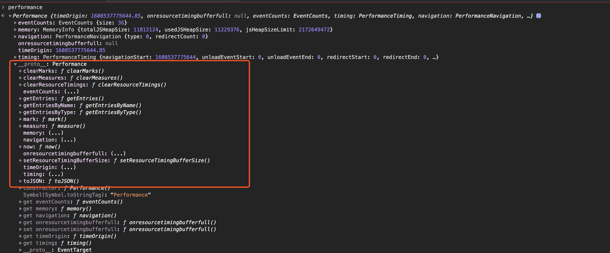

# Performance


## 一、属性
### 1、memory 浏览器内存情况

```js
memory: {
    jsHeapSizeLimit: 793000000 // 内存大小限制
    totalJSHeapSize: 35100000, // 可使用的内存
    usedJSHeapSize:  16100000, // JS 对象（包括V8引擎内部对象）占用的内存，一定小于 totalJSHeapSize
},
```

以字节计算
+ **jsHeapSizeLimit**：上下文内 可用堆的最大体积
+ **totalJSHeapSize**：表示当前js堆栈内存 总大小
+ **usedJSHeapSize**：表示所有 被使用的js堆栈内存

>这表示usedJSHeapSize不能大于totalJSHeapSize，如果大于，有可能出现了内存泄漏

### 2、 navigation 
告诉开发者当前页面是通过什么方式导航过来的

```js
navigation: {
    redirectCount: 0, // 如果有重定向的话，页面通过几次重定向跳转而来
    type: 0  // 如何进入的页面
},
```
#### type 种类：
+  0   即 TYPE_NAVIGATENEXT 正常进入的页面（非刷新、非重定向等）
+  1   即 TYPE_RELOAD       通过 window.location.reload() 刷新的页面
+  2   即 TYPE_BACK_FORWARD 通过浏览器的前进后退按钮进入的页面（历史记录）
+  255 即 TYPE_UNDEFINED    非以上方式进入的页面

### 3、 timing

```js
timing: {
    // 在同一个浏览器上下文中，前一个网页（与当前页面不一定同域）unload 的时间戳，如果无前一个网页 unload ，则与 fetchStart 值相等
    navigationStart: 1441112691935,

    // 前一个网页（与当前页面同域）unload 的时间戳，如果无前一个网页 unload 或者前一个网页与当前页面不同域，则值为 0
    unloadEventStart: 0,

    // 和 unloadEventStart 相对应，返回前一个网页 unload 事件绑定的回调函数执行完毕的时间戳
    unloadEventEnd: 0,

    // 第一个 HTTP 重定向发生时的时间。有跳转且是同域名内的重定向才算，否则值为 0 
    redirectStart: 0,

    // 最后一个 HTTP 重定向完成时的时间。有跳转且是同域名内部的重定向才算，否则值为 0 
    redirectEnd: 0,

    // 浏览器准备好使用 HTTP 请求抓取文档的时间，这发生在检查本地缓存之前
    fetchStart: 1441112692155,

    // DNS 域名查询开始的时间，如果使用了本地缓存（即无 DNS 查询）或持久连接，则与 fetchStart 值相等
    domainLookupStart: 1441112692155,
    // DNS 域名查询完成的时间，如果使用了本地缓存（即无 DNS 查询）或持久连接，则与 fetchStart 值相等
    domainLookupEnd: 1441112692155,

    // HTTP（TCP） 开始建立连接的时间，如果是持久连接，则与 fetchStart 值相等
    // 注意如果在传输层发生了错误且重新建立连接，则这里显示的是新建立的连接开始的时间
    connectStart: 1441112692155,

    // HTTP（TCP） 完成建立连接的时间（完成握手），如果是持久连接，则与 fetchStart 值相等
    // 注意如果在传输层发生了错误且重新建立连接，则这里显示的是新建立的连接完成的时间
    // 注意这里握手结束，包括安全连接建立完成、SOCKS 授权通过
    connectEnd: 1441112692155,

    // HTTPS 连接开始的时间，如果不是安全连接，则值为 0
    secureConnectionStart: 0,

    // HTTP 请求读取真实文档开始的时间（完成建立连接），包括从本地读取缓存
    // 连接错误重连时，这里显示的也是新建立连接的时间
    requestStart: 1441112692158,

    // HTTP 开始接收响应的时间（获取到第一个字节），包括从本地读取缓存
    responseStart: 1441112692686,

    // HTTP 响应全部接收完成的时间（获取到最后一个字节），包括从本地读取缓存
    responseEnd: 1441112692687,

    // 开始解析渲染 DOM 树的时间，此时 Document.readyState 变为 loading，并将抛出 readystatechange 相关事件
    domLoading: 1441112692690,

    // 完成解析 DOM 树的时间，Document.readyState 变为 interactive，并将抛出 readystatechange 相关事件
    // 注意只是 DOM 树解析完成，这时候并没有开始加载网页内的资源
    domInteractive: 1441112693093,

    // DOM 解析完成后，网页内资源加载开始的时间
    // 在 DOMContentLoaded 事件抛出前发生
    domContentLoadedEventStart: 1441112693093,

    // DOM 解析完成后，网页内资源加载完成的时间（如 JS 脚本加载执行完毕）
    domContentLoadedEventEnd: 1441112693101,

    // DOM 树解析完成，且资源也准备就绪的时间，Document.readyState 变为 complete，并将抛出 readystatechange 相关事件
    domComplete: 1441112693214,

    // load 事件发送给文档，也即 load 回调函数开始执行的时间
    // 注意如果没有绑定 load 事件，值为 0
    loadEventStart: 1441112693214,
    
    // load 事件的回调函数执行完毕的时间
    loadEventEnd: 1441112693215
}
```

+ DNS查询耗时 ：domainLookupEnd - domainLookupStart
+ TCP链接耗时 ：connectEnd - connectStart
+ request请求耗时 ：responseEnd - responseStart
+ 解析dom树耗时 ： domComplete - domInteractive
+ 白屏时间 ：responseStart - navigationStart
+ domready时间(用户可操作时间节点) ：domContentLoadedEventEnd - navigationStart
+ onload时间(总下载时间) ：loadEventEnd - navigationStart

<!-- 1. DNS解析耗时: domainLookupEnd - domainLookupStart
2. TCP连接耗时: connectEnd - connectStart
3. SSL安全连接耗时: connectEnd - secureConnectionStart
4. 网络请求耗时(TTFB): responseStart - requestStart
5. 数据传输耗时: responseEnd - responseStart
6. DOM解析耗时: domInteractive - responseEnd
7. 资源加载耗时: loadEventStart - domContentLoadedEventEnd
8. 首包时间: responseStart - domainLookupStart
9. 首次渲染时间 / 白屏时间: responseEnd - fetchStart
10. 首次可交互时间: domInteractive - fetchStart
11. DOM Ready时间: domContentLoadEventEnd - fetchStart
12. 页面完全加载时间: loadEventStart - fetchStart -->


## 二、方法


获取pint的时间，例如：
```js
const observer = new PerformanceObserver(list => {
    for (const entry of list.getEntries()) {
      console.log(entry.startTime);
    }
  })
observer.observe({
    entryTypes: ["paint"]
})
```

### getEntries() 获取所有资源请求的时间数据
这个函数返回的将是一个数组，包含了页面中所有的 HTTP 请求，这个函数返回一个按startTime排序的对象数组，数组成员除了会自动根据所请求资源的变化而改变以外，还可以用mark(),measure()方法自定义添加，该对象的属性中除了包含资源加载时间还有以下五个属性。


+ name：资源名称，是资源的绝对路径或调用mark方法自定义的名称
+ startTime:开始时间
+ duration：加载时间
+ entryType：资源类型，entryType类型不同数组中的对象结构也不同
+ initiatorType：谁发起的请求

#### entryType  

+ “paint”： 值为first-paint’首次绘制、'first-contentful-paint’首次内容绘制
+ “mark”：通过mark()方法添加到数组中的对象
+ “resource”
+ “measure”

::: tips 提示
目前通过，加载资源,initiatorType还无法返回"audio"和"video"，chrome中只能返回空字符串,firfox返回"other"
如果一个图片在页面内既用img引入，又作为背景图片引入，那么initiatorType返回的"img"
:::


### now()  
performance.now()是当前时间与performance.timing.navigationStart的时间差，以微秒（百万分之一秒）为单位的时间，与 Date.now()-performance.timing.navigationStart的区别是不受系统程序执行阻塞的影响，因此更加精准。

### other
#### getEntriesByName(name,type[optional])，
#### getEntriesByType(type)

+ name:想要筛选出的资源名
+ type:entryType的值中一个