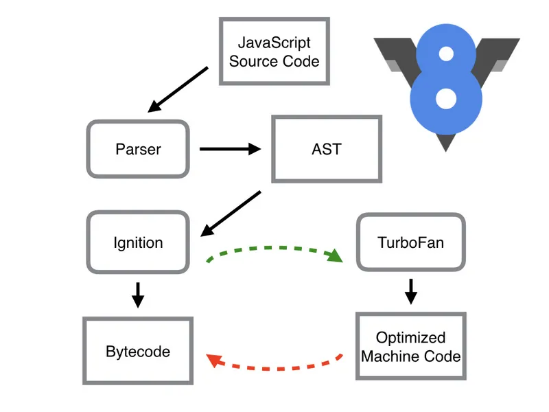

# V8 引擎

## 一、V8 的执行机制和内部结构

### 2.1 执行机制

V8 会编译 / 执行 js 代码，管理内存，负责垃圾回收，与宿主语言的交互等。通过暴露宿主对象 ( 变量，函数等 ) 到 js， js 可以访问宿主环境中的对象，并在脚本中完成对宿主对象的操作。

V8 执行一段 js 代码所经历的主要流程包括：

- 初始化基础环境；
- 解析源码生成 AST 和作用域；
- 依据 AST 和作用域生成字节码；
- 解释执行字节码；
- 监听热点代码；
- 优化热点代码为二进制的机器代码；
- 反优化生成的二进制机器代码。

### 2.2 V8 引擎的内部结构

V8 是一个非常复杂的项目，有超过 100 万行 C++代码。它由许多子模块构成，其中这 4 个模块是最重要的：

- Parser ：将 JS 源码转换为 AST
- Ignition（解释器）： 将 AST 转换为 字节码，解释执行，同时收集 TurboFan 优化编译所需的信息，比如函数参数的类型
- TurboFan (编译器) ：将 字节码 转换为经过优化的 汇编代码
- Orinoco：垃圾回收 ♻️

Parser，Ignition 以及 TurboFan 可以将 JS 源码编译为汇编代码，其流程图如下

通常有两种类型的解释器

1. 基于**栈**的解释器
   1. 使用栈来保存函数参数、中间运算结果、变量等
2. 基于**寄存器**的解释器
   1. 使用寄存器来保存参数、中间计算结果
   2. 现在的 V8 虚拟机则采用了基于寄存器的设计，它将一些中间数据保存到寄存器中

## 二、垃圾回收机制

v8 引擎将内存分为了新生代和老生代。借鉴了 Java VM 的垃圾回收管理

### 新生代和老生代。

- **新生代**：新创建的对象或者只经历过一次的垃圾回收的对象被称为新生代
- **老生代**：经历过多次垃圾回收的对象被称为老生代

新生代被分为 From 和 To 两个空间，To 一般是闲置的。

当 From 空间满了的时候会执行 Scavenge 算法进行垃圾回收。

当我们执行垃圾回收算法的时候应用逻辑将会停止，等垃圾回收结束后再继续执行。

这个算法分为三步：

1. 首先检查 From 空间的存活对象，如果对象存活则判断对象是否满足晋升到老生代的条件，如果满足条件则晋升到老生代。如果不满足条件则移动 To 空间
2. 如果对象不存活，则释放对象的空间
3. 最后将 From 空间和 To 空间角色进行交换。

#### 新生代对象晋升到老生代有两个条件：

1. 第一个是判断是对象否已经经过一次 Scavenge 回收。若经历过，则将对象从 From 空间复制到老生代中；若没有经历，则复制到 To 空间。
2. 第二个是 To 空间的内存使用占比是否超过限制。当对象从 From 空间复制到 To 空间时，若 To 空间使用超过 25%，则对象直接晋升到老生代中。设置 25% 的原因主要是因为算法结束后，两个空间结束后会交换位置，如果 To 空间的内存太小，会影响后续的内存分配。

老生代采用了标记清除法和标记压缩法。标记清除法首先会对内存中存活的对象进行标记，标记结束后清除掉那些没有标记的对象。由于标记清除后会造成很多的内存碎片，不便于后面的内存分配。所以了解决内存碎片的问题引入了标记压缩法。

由于在进行垃圾回收的时候会暂停应用的逻辑，对于新生代方法由于内存小，每次停顿的时间不会太长，但对于老生代来说每次垃圾回收的时间长，停顿会造成很大的影响。为了解决这个问题 V8 引入了增量标记的方法，将一次停顿进行的过程分为了多步，每次执行完一小步就让运行逻辑执行一会，就这样交替运行。

## 三、libuv

## 四、v8 进行了哪些优化

- JIT 即时编译： 编译的结果直接是机器语言，而不是字节码，大大提高了执行效率
- 隐藏类：V8 会为每个对象创建一个隐藏类，对象的隐藏类中记录了该对象一些基础的布局信息
- 内联缓存：this.a 没有内存缓存的时候每次 a 都会对哈希表进行一次寻址，加入 v8 之后能马上知道这个属性的偏移量
- 惰性解析

### 4.1 JIT 即时编译

在运行 C、C++以及 Java 等程序之前，需要进行编译，不能直接执行源码；

但对于 js 来说，我们可以直接执行源码(比如：node test.js)，它是在运行的时候先编译再执行，这种方式被称为即时编译(Just-in-time compilation)，简称为 JIT。因此，V8 也属于 JIT 编译器。

### 4.2 隐藏类

V8 会为每个对象创建一个隐藏类，对象的隐藏类中记录了该对象一些基础的布局信息，包括以下两点：

1. 对象中所包含的所有的属性；
2. 每个属性相对于对象的偏移量。

有了隐藏类之后，那么当 V8 访问某个对象中的某个属性时，就会先去隐藏类中查找该属性相对于它的对象的偏移量，有了偏移量和属性类型，V8 就可以直接去内存中取出对应的属性值，而不需要经历一系列的查找过程，那么这就大大提升了 V8 查找对象的效率。

**在 V8 中，把隐藏类又称为 map，每个对象都有一个 map 属性，其值指向内存中的隐藏类**

map 描述了对象的内存布局，比如对象都包括了哪些属性，这些数据对应于对象的偏移量是多少。

### 4.3 内联缓存

V8 引入了内联缓存（IC），IC 会监听每个函数的执行过程，并在一些关键的地方埋下监听点，这些包括了加载对象属性 (Load)、给对象属性赋值 (Store)、还有函数调用 (Call)，V8 会将监听到的数据写入一个称为反馈向量 (FeedBack Vector) 的结构中，同时 V8 会为每个执行的函数维护一个反馈向量。有了反馈向量缓存的临时数据，V8 就可以缩短对象属性的查找路径，从而提升执行效率。但是针对函数中的同一段代码，如果对象的隐藏类是不同的，那么反馈向量也会记录这些不同的隐藏类，这就出现了多态和超态的情况。我们在实际项目中，要尽量避免出现多态或者超态的情况。

### 4.4 惰性解析

所谓惰性解析是指解析器在解析的过程中，如果遇到函数声明，那么会跳过函数内部的代码，并不会为其生成 AST 和字节码，而仅仅生成顶层代码的 AST 和字节码。

在编译 js 代码的过程中，V8 并不会一次性将所有的 js 解析为中间代码

- 增加编译时间，影响 js 执行速度
- 字节码和机器代码会一直占用内存，解析完成的字节码和编译之后的机器代码都会存放在内存中，如果一次性解析和编译所有 js 代码，那么这些中间代码和机器代码将会一直占用内存。

### 4.5 预解析器

V8 引入预解析器，比如当解析顶层代码的时候，遇到了一个函数，那么预解析器并不会直接跳过该函数，而是对该函数做一次快速的预解析

- 判断当前函数是不是存在一些语法上的错误，发现了语法错误，那么就会向 V8 抛出语法错误；
- 检查函数内部是否引用了外部变量，如果引用了外部的变量，预解析器会将栈中的变量复制到堆中，在下次执行到该函数的时候，直接使用堆中的引用，这样就解决了闭包所带来的问题。
