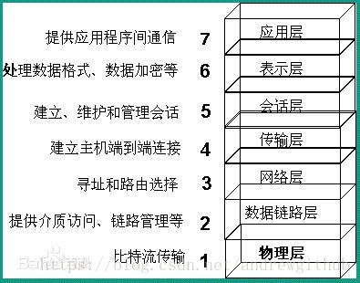

# 网络分层模型

### 划分网络模型的方式

当前存在三种划分网络模型的方式：

- OSI 七层模型
- TCP/IP 四层模型
- 五层模型

## OSI 七层模型

OSI 模型，即开放式通信系统互联参考模型(Open System Interconnection,OSI/RM,Open Systems Interconnection Reference Model)，是国际标准化组织(ISO)提出的一个试图使各种计算机在世界范围内互连为网络的标准框架，简称 OSI。
这是一种事实上被 TCP/IP 4 层模型淘汰的协议。**在当今世界上没有大规模使用**。

## TCP/IP 四层模型

TCP/IP 参考模型分为四个层次：应用层、传输层、网络互连层和物理+数据链路层。

OSI 是一个完整的、完善的宏观理论模型；而 TCP/IP(参考)模型，更加侧重的是互联网通信核心(也是就是围绕 TCP/IP 协议展开的一系列通信协议)的分层，因此它不包括物理层，以及其他一些不想干的协议;其次，之所以说他是参考模型，是因为他本身也是 OSI 模型中的一部分，因此参考 OSI 模型对其分层。

## 五层模型

五层体系结构包括：应用层、运输层、网络层、数据链路层和物理层。五层协议只是 OSI 和 TCP/IP 的综合，实际应用还是 TCP/IP 的四层结构。

所谓的五层协议的网络体系结构其实是为了方便学习计算机网络原理而采用的，综合了 OSI 七层模型和 TCP/IP 的四层模型而得到的五层模型。

### 1. 应用层

发起通信的地方，例如：浏览器，它使用传输层发送请求

### 2. 传输层

为运行在不同主机上的应用建立连接，例如：TCP 建立可靠连接，UDP 建立快速连接

### 3. 网络层

创建数据包，使用 IP 地址来标识数据包的源和目标

### 4. 数据链路层

负责创建 在网络中传输的帧，帧封装好数据包，使用 MAC 地址标识源和目标

### 5. 物理层

作为收发器处理网络中的信号 📶
