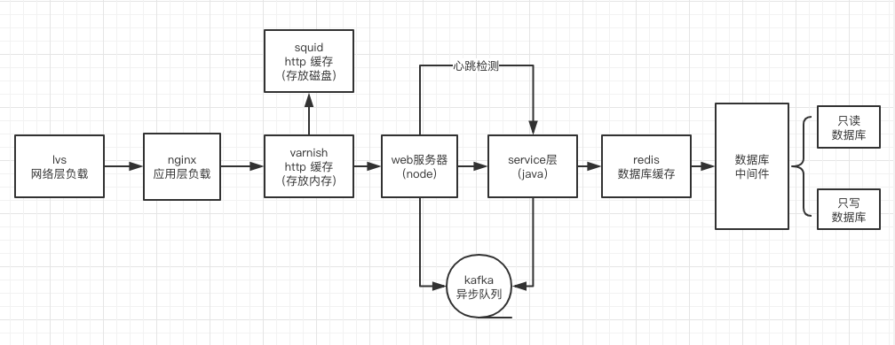

# node 基础
## 一、首先要知道的是
1. Node.js 不是一门语言也不是框架，它只是基于 Google V8 引擎的 JavaScript 运行时环境
2. 结合 Libuv 扩展了 JavaScript 功能，使得 JavaScript 能够同时具有 DOM 操作(浏览器)和 I/O、文件读写、操作数据库(服务器端)等能力
3. 基于事件驱动、非阻塞 I/O模型

Node.js 可用于多个领域的开发，例如：

+ 客户端应用程序（nw.js/electron）
+ 后端（webapi，网站等）
+ 工具（gulp，webpack 等构架工具）
+ 物联网，硬件（ruff）

Node的应用场景：
1. 充分利用操作系统提供的异步 I/O 进行多任务的执行，适合于 I/O 密集型的应用场景，
2. 因为异步，程序无需阻塞等待结果返回，而是基于回调通知的机制，原本同步模式等待的时间，则可以用来处理其它任务
3. 适合于**高并发应用场景**


## 二、Node.js 概念

Node.js 是基于 Chrome V8 引擎构建的，由事件循环（Event Loop）分发 I/O 任务，最终工作线程（Work Thread）将任务丢到线程池（Thread Pool）里去执行，而事件循环只要等待执行结果就可以了。

我们先来看一下 Node.js 早期的架构图。


- **Node.js Bindings 层** 将 Chrome V8 等暴露的 C/C++ 接口转成 JavaScript Api，并且结合这些 Api 编写了 Node.js 标准库，所有这些 Api 统称为 Node.js SDK。
- **V8 层** 是 Google 发布的开源 JavaScript 引擎，主要是将 JS 代码编译成原生机器码。
- **Thread Pool 层**：专门用来执行任务，执行完成后，将结果返回给 EventLoop 层。
- **EventLoop 层**：事件循环层，我们的代码在执行时，首先由 Event Loop 来接受处理，而真正执行操作的是具体的线程池（Thread Pool）里的 I/O 任务。之所以说 Node.js 是单线程，就是因为在接受任务的时候是单线程的，它无需进程/线程切换上下文的成本，非常高效，但它在执行具体任务的时候是多线程的。

::: tip 提示
Event Loop 事件循环，Thread Pool 线程池都是由 Libuv 提供，Libuv 是整个 Node.js 运行的核心。是一个基于事件驱动的跨平台抽象层，封装了不同操作系统一些底层特性，对外提供统一的API，事件循环机制也是它里面的实现
:::

## 三、异步编程

异步编程是 Node.js 的一大特色，掌握好 Node.js 的异步编程是每个 Node.js 开发者必备的技能。

### 3.1 异步 IO 的好处

- 前端通过异步 IO 可以消除阻塞。
- 请求耗时少，假如有两个请求 A 和 B，那么异步 IO 用时为：Max（A+B）。同步则为 A+B，请求越多差距越大。
- IO 是昂贵的，分布式 IO 是更昂贵的。
- Node.js 适用于 IO 密集型，而不适用于 CPU 密集型。
- 并不是所有都用异步任务好，遵循一个公式： s= (Ws+Wp)/(Ws+Wp/p) Ws 表示同步任务，Wp 表示异步任务，p 表示处理器的数量。

### 3.2 Node.js 对异步 IO 的实现

我们来看一下 Node.js 异步 IO 实现图：


- 应用程序先将 JS 代码经 V8 转换为机器码。
- 通过 Node.js Bindings 层，向操作系统 Libuv 的事件队列中添加一个任务。
- Libuv 将事件推送到线程池中执行。
- 线程池执行完事件，返回数据给 Libuv。
- Libuv 将返回结果通过 Node.js Bindings 返回给 V8。
- V8 再将结果返回给应用程序。

应用程序 -> V8 -> 机器码 -> Bindings层 -> Libuv -> 线程池 -> Libuv -> Bindings -> V8 -> 应用程序

**Libuv** 实现了 Node.js 中的 Eventloop ，主要有以下几个阶段：

```js
   ┌───────────────────────────┐
┌─>│           timers          │
│  └─────────────┬─────────────┘
│  ┌─────────────┴─────────────┐
│  │     pending callbacks     │
│  └─────────────┬─────────────┘
│  ┌─────────────┴─────────────┐
│  │       idle, prepare       │
│  └─────────────┬─────────────┘      ┌───────────────┐
│  ┌─────────────┴─────────────┐      │   incoming:   │
│  │           poll            │<─────┤  connections, │
│  └─────────────┬─────────────┘      │   data, etc.  │
│  ┌─────────────┴─────────────┐      └───────────────┘」
│  │           check           │
│  └─────────────┬─────────────┘
│  ┌─────────────┴─────────────┐
└──┤      close callbacks      │
   └───────────────────────────┘
```

上图中每一个阶段都有一个先进先出的回调队列，只有当队列内的事件执行完成之后，才会进入下一个阶段。


- timers：执行 `setTimeout` 和 `setInterval` 中到期的 callback。
- pending callbacks：上一轮循环中有少数的 I/O callback 会被延迟到这一轮的这一阶段执行。
  - 执行一些系统操作的回调，例如 tcp 连接发生错误。
- idle, prepare：仅内部使用。
- poll：最为重要的阶段，执行 I/O callback(node 异步 api 的回调，事件订阅回调等)，在适当的条件下会阻塞在这个阶段。
  - 如果 poll 队列不为空，直接执行队列内的事件，直到队列清空。
  - 如果 poll 队列为空。
    - 如果有设置 setImmediate，则直接进入 check 阶段。
    - 如果没有设置 setImmediate，则会检查是否有 timers 事件到期。
      - 如果有 timers 事件到期，则执行 timers 阶段。
      - 如果没有 timers 事件到期，则会阻塞在当前阶段，等待事件加入。
- check：执行 `setImmediate` 的 callback。
- close callbacks：执行 close 事件的 callback，例如 socket.on("close",func)。

**除此之外，Node.js 提供了 process.nextTick(微任务，promise 也一样) 方法，在以上的任意阶段开始执行的时候都会触发。**

::: tip 小知识

- Event Loop 是一个很重要的概念，指的是计算机系统的一种运行机制。
- Libuv 在 Linux 下基于 Custom Threadpool 实现。
- Libuv 在 Windows 下基于 IOCP 实现。
  :::

### 3.3 常用的异步 IO 使用方式

- 使用 step，q，async 等异步控制库。
- 使用 Promise 处理异步。
- 使用 EventEmitter，实现“发布/订阅”模式处理异步。
- Node.js 暂不支持协程，可使用 Generator 代替。
- 终极解决方案：async、await。

## 四、Node.js 内存管理与优化

Node.js 是单线程的，所以必须保证这个线程持续稳定，最容易导致 Node.js 应用程序挂掉的因素是内存泄漏。

常见的内存泄漏：
- 无限增长的数组。
- 无限制设置对象的属性和值。
- 任何模块的私有变量都是永驻的。
- 大循环，无 GC 机会。
- 队列消费不及时。
- 全局变量太多。

Node.js 采用 V8 的 分代式垃圾回收策略，将内存分为**新生代内存**和**老生代内存**。

- **新生代内存**通过 Scavenge 算法，将内存分为 From 空间 和 To 空间，初始时 From 空间存放所有对象，To 空间空闲。在一次垃圾回收时，清除 From 空间中没有使用的对象，然后将 To 空间和 From 交换。
- **老生代内存**通过 Mark-Sweep 和 Mark-compact，标记清除和移动清除。标记没有使用的内存空间，标记完毕后进行统一清除，清除后为了避免内存空间不连续，会将已使用的内存连在一起，放在队列的一端，然后清除另一端的所有内存空间。

## 五、Node.js 调试与部署

由于 Node.js 单线层的原因，所以 Node.js 的调试和部署特别重要，因为一旦出错，整个应用程序就挂了。

### 5.1 Node.js 调试

- node --inspect app.js
  - 打开浏览器进行调试：chrome://inspect/#devices
- 使用 vscode 自带的调试。

### 5.2 Node.js 部署

Node.js 端一般不会直接当成项目后端来使用，而是当成一个 BFF 层来使用。具体要怎么架构呢？

这是一个 Node.js 项目架构。


- 用户请求 Node.js 服务器。
- 经过 LVS 传输层负载均衡。
- 经过 Nginx 服务器，反向代理，负载均衡到多个 PM2 运行的机器上。
  - PM2 守护进程，保证 Node.js 进程永远都活着, Node.js 挂掉后自动 0 秒的重载。
- 配置 Varnish、Squid，实现服务器 HTTP 缓存。
- Node.js 作为 Web 服务器层，会将请求转发给 Java 服务器。
  - 配置心跳检测 Heartbeats，检测 Java 端是否挂掉。
- Java 服务器根据请求，进行相应的处理，可能会对数据库进行读写操作。
- 读取或写入 Database。
  - 只读数据库。
  - 只写数据库。
- Java 服务器将数据库访问结果返回给 Node.js 层。
- Node.js 层将结果返回给用户。

### 5.3 Node.js Web 端应用程序部署流程

- 单元测试。
- 压力测试，性能分析工具找 Bug。
  - 提前发现内存泄漏问题。
  - 根据压力测试，准确计算 QPS ，推算出服务器性能。
- 静态资源上传到 CDN。
- 配置 Nginx 实现负载均衡和反向代理。
- 开启 PM2 守护进程，小流量灰度上线。

剩下的工作交给运维和后端去完成，例如：配置 Web 服务器缓存 Varnish，心跳检测等。