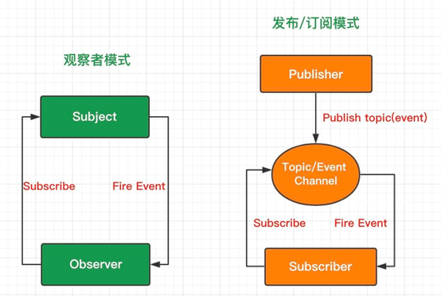

# 观察者模式||发布-订阅模式

#### 两种模式的区别



可以看出，`发布-订阅模式`相比`观察者模式`多了个事件通道，事件通道作为调度中心，管理事件的订阅和发布工作，彻底隔绝了订阅者和发布者的依赖关系。

即订阅者在订阅事件的时候，只关注事件本身，而不关心谁会发布这个事件；发布者在发布事件的时候，只关注事件本身，而不关心谁订阅了这个事件。

## 观察者模式

观察者模式 在软件设计中是一个对象，维护一个依赖列表，当任何状态发生改变自动通知它们。

```js
class Subject {
  constructor() {
    this.observers = [];
  }

  add(observer) {
    this.observers.push(observer);
  }

  notify(...args) {
    this.observers.forEach((observer) => observer.update(...args));
  }
}

class Observer {
  update(...args) {
    console.log(...args);
  }
}

// 创建观察者ob1
let ob1 = new Observer();
// 创建观察者ob2
let ob2 = new Observer();
// 创建目标 sub
let sub = new Subject();
// 目标sub添加观察者ob1 （目标和观察者建立了依赖关系）
sub.add(ob1);
// 目标sub添加观察者ob2
sub.add(ob2);
// 目标sub触发SMS事件（目标主动通知观察者）
sub.notify("I fired `SMS` event");
```

## 发布-订阅模式

在观察者模式中的`Subject`就像一个发布者`（Publisher）`，观察者`（Observer）`完全和订阅者`（Subscriber）`关联。`subject`通知观察者就像一个发布者通知他的订阅者。

```ts
// 发布订阅中心, on-订阅, off取消订阅, emit发布, 内部需要一个单独事件中心caches进行存储;

interface CacheProps {
  [key: string]: Array<((data?: unknown) => void)>;
}

class Observer {

  private caches: CacheProps = {}; // 事件中心

  on (eventName: string, fn: (data?: unknown) => void){ // eventName事件名-独一无二, fn订阅后执行的自定义行为
    this.caches[eventName] = this.caches[eventName] || [];
    this.caches[eventName].push(fn);
  }

  emit (eventName: string, data?: unknown) { // 发布 => 将订阅的事件进行统一执行
    if (this.caches[eventName]) {
      this.caches[eventName].forEach((fn: (data?: unknown) => void) => fn(data));
    }
  }

  off (eventName: string, fn?: (data?: unknown) => void) { // 取消订阅 => 若fn不传, 直接取消该事件所有订阅信息
    if (this.caches[eventName]) {
      const newCaches = fn ? this.caches[eventName].filter(e => e !== fn) : [];
      this.caches[eventName] = newCaches;
    }
  }

}
```

## 总结

1. 在观察者模式中，观察者是知道 Subject 的，Subject 一直保持对观察者进行记录。然而，在发布订阅模式中，发布者和订阅者不知道对方的存在。它们只有通过消息代理进行通信。
2. 在发布订阅模式中，组件是松散耦合的，正好和观察者模式相反。
3. 观察者模式大多数时候是同步的，比如当事件触发，Subject 就会去调用观察者的方法。而发布-订阅模式大多数时候是异步的（使用消息队列）。
4. 观察者 模式需要在单个应用程序地址空间中实现，而发布-订阅更像交叉应用模式。
