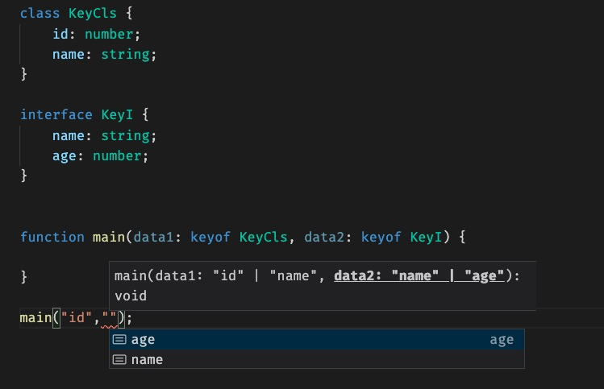

# 高级类型
+ 交叉类型（Intersection Types）
+ 联合类型（Union Types）
+ 类型保护（Type Guards）
+ 索引类型（Index types）
+ 映射类型

## 交叉类型
交叉类型是将多个类型合并为一个类型，它包含了所需的所有类型的特性

例如， `Person & Serializable & Loggable` ， 就是说这个类型的对象同时拥有了这三种类型的成员。
```ts
function extend<T, U>(first: T, second: U): T & U {
    let result = <T & U>{};
    for (let id in first) {
        (<any>result)[id] = (<any>first)[id];
    }
    for (let id in second) {
        if (!result.hasOwnProperty(id)) {
            (<any>result)[id] = (<any>second)[id];
        }
    }
    return result;
}

class Person {
    constructor(public name: string) { }
}
interface Loggable {
    log(): void;
}
class ConsoleLogger implements Loggable {
    log() {
        // ...
    }
}
var jim = extend(new Person("Jim"), new ConsoleLogger());
var n = jim.name;
jim.log();
```

## 联合类型

我们只能访问此联合类型的所有类型里**共有**的成员


## 类型保护
类型保护使你可以用运算符检查变量或对象的类型。它实际上是一个检查用 `typeof`、`instanceof` 或 `in` 所返回类型的条件块。

### 1、typeof
```ts
function showType(x: number | string) {
  if (typeof x === "number") {
    return `The result is ${x + x}`
  }
  throw new Error(`This operation can't be done on a ${typeof x}`)
}

showType("I'm not a number")
// Error: This operation can't be done on a string

showType(7)
// Output: The result is 14
```
代码中有一个普通的 JavaScript 条件块，该块检查通过 `typeof` 检测到的参数的类型。在这种情况下就保护你的类型了。
### 2、instanceof
```ts
class Foo {
  bar() {
    return "Hello World"
  }
}

class Bar {
  baz = "123"
}

function showType(arg: Foo | Bar) {
  if (arg instanceof Foo) {
    console.log(arg.bar())
    return arg.bar()
  }

  throw new Error("The type is not supported")
}

showType(new Foo())
// Output: Hello World

showType(new Bar())
// Error: The type is not supported
```
和像前面的例子一样，这也是一个类型保护，它检查接收到的参数是否为 `Foo` 类的一部分，并对其进行处理。
### 3、in
```ts
interface FirstType {
  x: number
}
interface SecondType {
  y: string
}

function showType(arg: FirstType | SecondType) {
  if ("x" in arg) {
    console.log(`The property ${arg.x} exists`)
    return `The property ${arg.x} exists`
  }
  throw new Error("This type is not expected")
}

showType({ x: 7 })
// Output: The property 7 exists

showType({ y: "ccc" })
// Error: This type is not expected
```
在代码中，`in` 运算符用来检查对象上是否存在属性 `x`。
## Conditional 类型
用来对两种类型进行测试，并根据测试的结果选择其中的一种
```ts
type NonNullable<T> = T extends null | undefined ? never : T
```
这个例子中的 `NonNullable` 检查该类型是否为 `null` 并根据该类型进行处理。


### 4. is
是TS本身使用typeof和改进类型的方式instanceof


## 索引类型（Index types）
### 1. 索引类型的查询操作符 
```
keyof T 
表示类型T的所有公共属性的字面量的联合类型
```
从对象中获取一些属性的值,然后建立一个集合
### keyof

上图找中keyof用于检测该属性是否属于 当前类型的key
```ts
interface obj {
  name:string
  age:number
}
// 此时,key的类型为 "name" | "age"
let key:keyof obj //  ->let key: "name" | "age"
```

### 2. 索引访问操作符
```
T[K]
表示对象T的属性K所代表的类型
```

```ts
interface obj {
  name:string
  age:number
}
// 此时,key的类型为 "name"
let key:obj['name'] //  ->let key: string
```